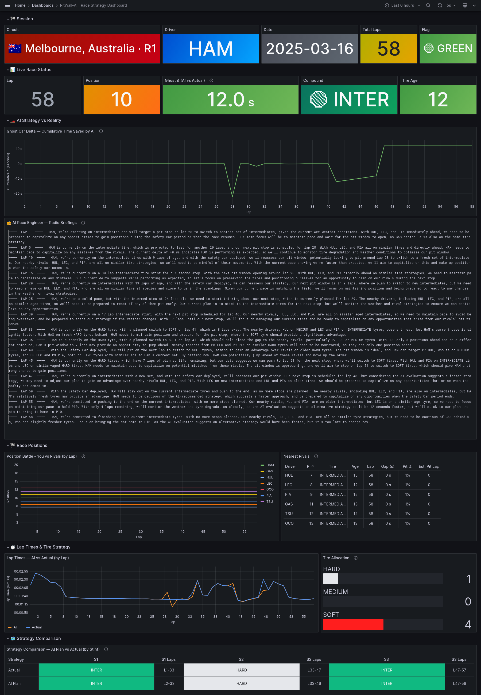
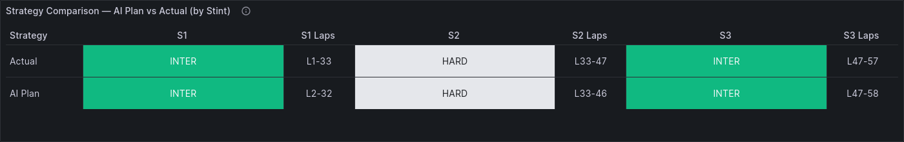

<div align="center">

# 🏎️ PitWall-AI

### *An agentic F1 race strategy engine — powered by LangGraph, PyTorch, genetic algorithms, and an LLM race engineer.*

[](https://www.python.org/downloads/)
[](https://pytorch.org/)
[](https://langchain-ai.github.io/langgraph/)
[](https://grafana.com/)
[](https://www.influxdata.com/)
[](https://opensource.org/licenses/MIT)

**🚦 Scout → 🕵️ Spy → 🧠 Strategist → 👻 Ghost Car → 🎙️ Principal**

*Five specialised agents, one lap at a time, fighting for the fastest race strategy on the grid.*



</div>

---

## 🏁 What is PitWall-AI?

**PitWall-AI** is an end-to-end Formula 1 race-strategy simulator that makes per-lap pit-stop and compound decisions with the same class of reasoning a real team's pitwall does — but entirely automated.

Each lap, a pipeline of cooperating AI agents:

1. **👁️ Ingests live telemetry and timing** from the OpenF1 API
2. **🕵️ Predicts what rival drivers are about to do** using a Bayesian pit-stop hazard model
3. **🧬 Evolves the optimal remaining-race strategy** with a DEAP genetic algorithm on top of a PyTorch tire-degradation network
4. **👻 Scores that strategy against the real driver's decisions** using a ghost-car evaluator immune to model prediction drift
5. **🎙️ Writes a natural-language team-radio briefing** via Groq's LLaMA-3.3-70B — and, at race-end, a full post-race debrief

Everything gets streamed to **InfluxDB** and visualised on a **32-panel Grafana dashboard** that shows live deltas, compound strategies, AI-vs-actual lap times, race-engineer radio, and more.

> You can run **replay mode** on any race from 2023-2025 at up to 1000× speed, or point it at a **live Grand Prix** currently on-track.

---

## ✨ Highlights

| | |
|---|---|
| 🧠 **Agentic pipeline** | 5 specialised agents orchestrated with LangGraph, each with a clear role and clean state boundaries |
| 🧬 **GA strategy search** | DEAP-based genetic algorithm evolves stint plans, strictly enforces 2+ compound diversity at every stage |
| 🔥 **PyTorch tire model** | MLP that predicts per-lap degradation from compound, age, fuel load, track temperature (and optionally rainfall/humidity) |
| 👻 **Ghost car evaluator** | Relative-delta scoring so model error does **not** accumulate into the AI-vs-actual verdict |
| 🎙️ **LLM race engineer** | Groq-hosted LLaMA 3.3 70B writes in-race radio briefings and post-race debriefs; graceful template fallback when offline |
| 📊 **Production-grade dashboard** | InfluxDB-backed Grafana with per-panel Flux queries, run-scoped to current session, rendered with color-emoji fonts |
| ⚡ **1000× replay** | Burn through a full Bahrain GP in ~10 seconds, or drive live at 1× |
| ✅ **Deterministic tests** | 719 LOC of pytest suite, no network, runs in < 10 s |

---

## 🏛️ Architecture

```
                              ┌──────────────────────────┐
                              │      OpenF1 / FastF1     │
                              │  (telemetry, laps, pits) │
                              └────────────┬─────────────┘
                                           │
                                    ┌──────▼──────┐
                                    │   🚦 Scout  │   data ingestion
                                    └──────┬──────┘
                                           │
                                    ┌──────▼──────┐
                                    │   🕵️ Spy    │   rival pit prediction
                                    └──────┬──────┘    (Bayesian hazard)
                                           │
                                    ┌──────▼──────┐
                                    │ 🧠 Strategist│   DEAP genetic algorithm
                                    └──────┬──────┘   over PyTorch tire model
                                           │
                                    ┌──────▼──────┐
                                    │  👻 Ghost    │   AI-vs-actual delta
                                    │   Evaluator  │   (relative-compound)
                                    └──────┬──────┘
                                           │
                                    ┌──────▼──────┐
                                    │ 🎙️ Principal│   Groq LLaMA 3.3 70B
                                    └──────┬──────┘   → radio briefing
                                           │
                              ┌────────────▼─────────────┐
                              │        InfluxDB          │
                              │   ↓                      │
                              │        Grafana           │
                              └──────────────────────────┘
```

### The five agents

| Agent | File | Role |
|-------|------|------|
| **🚦 Scout** | `pitwall/agents/scout.py` | Async ingestion of laps, stints, positions, and race-control messages from OpenF1 |
| **🕵️ Spy** | `pitwall/agents/spy.py` | Predicts when rivals ahead / behind will pit, using a logistic hazard model fitted per compound |
| **🧠 Strategist** | `pitwall/agents/strategist.py` | DEAP GA that evolves `(compound, stint_length)` plans, enforcing FIA 2-compound rule at **every** GA operator (creation, crossover, mutation, repair) |
| **👻 Ghost Car Evaluator** | `pitwall/agents/evaluator.py` | Compares AI strategy to actual using pure strategic-delta accounting — same compound → delta 0, different compound → *relative* model prediction, pit stops → exact pit-loss bookkeeping |
| **🎙️ Principal** | `pitwall/agents/principal.py` | LLM agent that turns state + strategy + ghost delta into a conversational team-radio briefing, with a template fallback when Groq rate-limits |

### State graph (LangGraph)

```
Scout ──► Spy ──► Strategist ──► Evaluator ──► Principal ──► END
```

One pass per lap. State is a frozen `RaceState` dataclass that accumulates laps, stints, positions, race-control messages, rival intel, current strategy, ghost-car bookkeeping, and the latest briefing.

### Physics-aware tire model

`pitwall/models/tire_model.py` ships two things:

- **A PyTorch MLP** (`TireModel`) that learns degradation from compound × age × fuel × track temperature (V1) or + rainfall / humidity / track_wetness (V2 via FastF1).
- **Calibrated `CompoundProfile` fallbacks** derived from 2023-2025 stint data — used automatically when no trained checkpoint exists, and mixed into training (~30%) to anchor compound physics against the fuel-correlation bias in real-world data.

Key design details baked in:
- `math.exp` exponents clamped to `[-500, 500]` (no overflow)
- `remaining_laps = total_laps - current_lap + 1` (off-by-one-proof)
- First-stint compound is **locked** to the currently mounted tire — no teleporting
- Ghost deltas are **never capped** — the root cause is fixed at the model level instead

---

## 📡 Where the data comes from

| Source | Used for | Live? |
|--------|----------|-------|
| **[OpenF1](https://openf1.org)** (`pitwall/data/openf1_client.py`) | Laps, stints, positions, race control, session resolution. Primary live-race feed. | ✅ |
| **[FastF1](https://docs.fastf1.dev/)** (`pitwall/data/fastf1_client.py`) | Historical training data **with weather features** (rainfall, humidity, track wetness) for the V2 tire model. | ❌ |
| **[Groq API](https://console.groq.com/)** (LLaMA 3.3 70B) | Race-engineer radio briefings and post-race debriefs. | ✅ |

Both data clients are fully async, retry with exponential backoff, and cache aggressively for replay mode.

---

## 🚀 Quick start

### 1. Clone & install

```bash
git clone https://github.com/rohan-chandrashekar/pitwall-ai.git
cd pitwall-ai

python -m venv .venv
source .venv/bin/activate         # Windows: .venv\Scripts\activate

pip install -r requirements.txt
```

### 2. Configure

```bash
cp .env.example .env
# Edit .env and drop in your Groq key (free at https://console.groq.com/keys)
```

`.env` accepts:

```env
GROQ_API_KEY=gsk_...
INFLUXDB_URL=http://localhost:8086
INFLUXDB_TOKEN=pitwall-token
```

> 🧊 **Groq & Influx are optional.** Without Groq, Principal uses templated briefings. Without Influx, the dashboard is skipped but the CLI still runs.

### 3. Fire up the dashboard stack (optional but recommended)

```bash
docker compose up -d
```

This boots:
- `pitwall-influxdb` on `localhost:8086`
- `pitwall-grafana`  on `localhost:3000`  (login `admin` / `pitwall`)
- `pitwall-renderer` on `localhost:8081`  (for PNG exports)

The Grafana dashboard is auto-provisioned from `grafana/dashboard.json` and set as the home page.

---

## 🧠 Training the tire model

PitWall-AI ships with `models/tire_deg.pt` already trained, but you can (and should) retrain it.

### V1 — OpenF1, no weather

```bash
python -m pitwall --train --seasons 2023 2024 2025
```

- Pulls every lap + stint from three seasons via OpenF1
- Mixes in ~30 % synthetic data from calibrated compound profiles (prevents the net from learning "SOFT = slow" purely via the fuel-load correlation)
- Validates that `HARD − SOFT` compound differentiation is ≥ 0.5 s/lap and refuses to ship the model otherwise

### V2 — FastF1, with weather features

```bash
python -m pitwall --train-fastf1 --seasons 2023 2024 2025
```

Adds `rainfall`, `humidity`, and `track_wetness` to the feature vector — essential for realistic wet-weather strategy evaluation.

Training writes to `models/tire_deg.pt`. Re-runs overwrite the file atomically.

---

## 🏎️ Running a race

### Historical replay (the fun one)

```bash
# Bahrain 2024, Max Verstappen, 1000× speed
python -m pitwall --race bahrain-2024 --driver VER --speed 1000

# Monaco 2024, Lewis Hamilton, real-time
python -m pitwall --race monaco-2024 --driver HAM --speed 1

# Works for any 2023-2025 race; see pitwall/data/openf1_client.py for aliases
python -m pitwall --race spa-2024        --driver LEC --speed 500
python -m pitwall --race interlagos-2024 --driver NOR --speed 200
```

### Live race mode

```bash
python -m pitwall --race live --driver VER
```

Auto-resolves the currently on-track session (practice, qualifying, or race) and polls OpenF1.

### CLI flags at a glance

| Flag | What it does |
|------|--------------|
| `--race <name\|live>` | Race slug (`bahrain-2024`, `monaco-2024`, …) or `live` |
| `--driver <code>` | 3-letter driver code (`VER`, `HAM`, `LEC`, …) |
| `--speed <float>` | Replay multiplier; `1000` for fast replay, `1` for real-time |
| `--train` | Train the V1 tire model from OpenF1 |
| `--train-fastf1` | Train the V2 tire model from FastF1 (with weather) |
| `--seasons 2023 2024 2025` | Seasons to train on |
| `--groq-key <key>` | Override `GROQ_API_KEY` for a single run |

---

## 📊 The Dashboard

Once a race is running and Influx is up, open **[http://localhost:3000](http://localhost:3000)** (login `admin` / `pitwall`) — the PitWall dashboard is the home page.

### Panels at a glance

<table>
<tr>
<td width="40%"><strong>🌍 Session header</strong></td>
<td>Flag + circuit + round ("🇦🇺 Melbourne, Australia · R1"), driver, date, total laps, flag status</td>
</tr>
<tr>
<td><strong>🟢 Live Race Status</strong></td>
<td>Live position, gap-to-AI-estimate, current compound, tire age</td>
</tr>
<tr>
<td><strong>📈 AI Strategy vs Reality</strong></td>
<td>Rolling cumulative time saved (or lost) by the AI plan vs actual</td>
</tr>
<tr>
<td><strong>🎙️ Race Engineer — Radio</strong></td>
<td>Streaming lap-by-lap briefings from the Principal agent</td>
</tr>
<tr>
<td><strong>🧭 Race Positions</strong></td>
<td>Position-vs-lap trace, live gaps, recent pit stops with ages</td>
</tr>
<tr>
<td><strong>⏱️ Lap Times — AI vs Actual</strong></td>
<td>Overlay of AI-predicted and actual lap times (y-axis in <code>mm:ss</code>)</td>
</tr>
<tr>
<td><strong>🛞 Strategy Comparison</strong></td>
<td>Side-by-side compound + lap-range per stint, AI Plan vs Actual</td>
</tr>
<tr>
<td><strong>🏁 Race Result</strong></td>
<td>Actual finish, estimated-AI finish, delta, positions gained (= actual − AI), pit-stop diff, and a verdict</td>
</tr>
<tr>
<td><strong>📝 Post-Race Debrief</strong></td>
<td>LLM-generated full-race analysis (scoped to the current run only — no stale data)</td>
</tr>
</table>

### Examples

<div align="center">




</div>

> 💡 Every panel that shows a single-race metric is **scoped to the current run** via the latest `briefing lap=1` timestamp pattern, so you never see stale data from a previous session.

### Behind the scenes

- **Flux queries** build every panel straight off InfluxDB — no pre-aggregation.
- **Run isolation**: each query pins to `runStartRec._time` derived from the newest `briefing lap=1` event for the current driver/track.
- **Color-emoji rendering**: the `grafana-image-renderer` container has `font-noto-emoji` installed so flag emojis render in PNG exports.
- **Compound colouring** uses Grafana table value-mappings:
  - 🔴 SOFT  — `#FF1E1E`
  - 🟡 MEDIUM — `#FFD700`
  - ⚪ HARD — `#E5E7EB`
  - 🟢 INTERMEDIATE — `#10B981`
  - 🔵 WET — `#3B82F6`

---

## 🧪 Tests

```bash
python -m pytest tests/ -x -q
```

- No network. The OpenF1 client is mocked everywhere.
- Runs in under 10 seconds on a laptop CPU.
- Covers tire model, strategist GA (compound diversity at every operator), ghost evaluator (relative-delta invariants), spy hazard curves, and an end-to-end integration test.

---

## 🗂️ Project structure

```
F1/
├── pitwall/                     # main package (run with `python -m pitwall`)
│   ├── __main__.py              # CLI entry point
│   ├── graph.py                 # LangGraph orchestration + RaceRunner
│   ├── state.py                 # shared dataclasses
│   ├── influx.py                # Grafana metrics writer
│   ├── agents/
│   │   ├── scout.py             # 🚦 data ingestion
│   │   ├── spy.py               # 🕵️ rival pit prediction
│   │   ├── strategist.py        # 🧠 DEAP GA
│   │   ├── evaluator.py         # 👻 ghost car
│   │   └── principal.py         # 🎙️ LLM briefings
│   ├── models/
│   │   ├── tire_model.py        # PyTorch MLP + compound profiles
│   │   └── overtake_model.py    # probabilistic overtake model
│   └── data/
│       ├── openf1_client.py     # async OpenF1 client
│       └── fastf1_client.py     # FastF1 training loader
├── grafana/
│   ├── dashboard.json           # 32-panel dashboard definition
│   ├── dashboard-provider.yml   # auto-provisioning
│   └── datasource.yml           # InfluxDB datasource config
├── tests/                       # pytest suite (no network, < 10 s)
├── models/
│   └── tire_deg.pt              # trained PyTorch checkpoint
├── docker-compose.yml           # InfluxDB + Grafana + renderer
├── requirements.txt
├── pyproject.toml
└── .env.example
```

---

## 🛠️ Tech stack

| Layer | Tool |
|-------|------|
| Orchestration | [LangGraph](https://langchain-ai.github.io/langgraph/) |
| Neural tire model | [PyTorch](https://pytorch.org/) |
| Genetic algorithm | [DEAP](https://deap.readthedocs.io/) |
| LLM | [Groq](https://groq.com/) · LLaMA 3.3 70B Versatile |
| F1 data | [OpenF1](https://openf1.org) · [FastF1](https://docs.fastf1.dev/) |
| Metrics store | [InfluxDB 2.7](https://www.influxdata.com/) (Flux) |
| Dashboard | [Grafana 10.2](https://grafana.com/) + image-renderer |
| Async HTTP | [httpx](https://www.python-httpx.org/) |
| Tests | [pytest](https://pytest.org/) |

---

## 🤔 Design notes worth knowing

A handful of decisions from the trenches that were easy to get wrong:

- **Compound diversity is enforced at every GA operator** — creation, crossover, mutation, and repair — not just at final filter. One layer is never enough; the GA always finds the loophole.
- **First-stint compound is locked** to the tire currently mounted. Prevents "teleporting" to a fresh compound mid-stint.
- **Ghost deltas are never capped.** If the delta blew up, that's a bug in the tire model or the strategist — capping just hides the signal.
- **Relative-compound deltas** in the ghost evaluator mean model error cancels out. Absolute predictions accumulated 1 s/lap × 57 laps of noise; the relative design is immune.
- **Synthetic data mixed into training.** Real F1 data correlates SOFT with high fuel (race start) and HARD with low fuel (mid-race). Without synthetic anchoring, the network happily learns "SOFT = slow" from fuel correlation rather than tire physics.
- **All `math.exp` exponents clamped to `[-500, 500]`** to make the hazard sigmoid and softmax calls overflow-proof.
- **Panel queries scope to the current run.** The dashboard finds the latest `briefing lap=1` event and uses its timestamp as the query's `start` — stale data from a previous session simply can't render.

---

## 🗺️ Roadmap ideas

- [ ] Multi-driver simultaneous strategy (full grid view)
- [ ] Overtake probability overlay on the race-positions panel
- [ ] Weather-forecast-aware strategist (rain-cross lap window)
- [ ] Qualifying-mode pipeline (single-lap pace optimisation)
- [ ] Web UI alternative to Grafana for mobile pit-wall viewing

Got an idea? Open an issue 🙌

---

## 📜 License

MIT. See [`LICENSE`](LICENSE).

---

<div align="center">

### ⚡ Built with caffeine, Python, and a love of 57-lap optimisation problems.

*If this project helped you, a ⭐ goes a very long way.*

</div>
